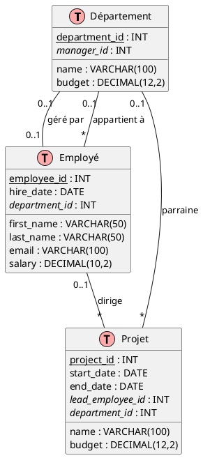
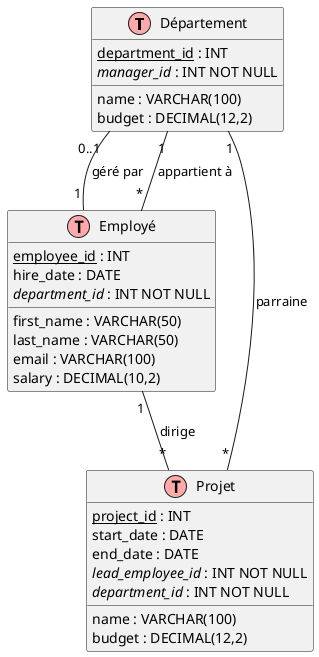

# 5- Gestion des dépendances circulaires dans la conception de bases de données

## Introduction

Une **dépendance circulaire** se produit lorsque deux tables ou plus se référencent mutuellement via des clés
étrangères, créant ainsi un problème de type « œuf ou poule » lors de la création des tables. Il s'agit d'un scénario
courant dans la conception de bases de données réelles que vous devez apprendre à gérer correctement.

## Le scénario problématique

Considérons un cas d'entreprise classique où :

- Les **employés** travaillent dans des **départements**
- Les **départements** ont des **responsables** (qui sont également des employés)
- Les **projets** sont dirigés par des **employés** et parrainés par des **départements**

Cela crée une dépendance circulaire : Employé → Département → Employé (responsable)

## Diagramme entité-relation (DER)



??? note "Code"

    ```plantuml
    @startuml
    
    !define TABLE(name,desc) class name as "desc" << (T,#FFAAAA) >>
    !define PK(x) <u>x</u>
    !define FK(x) <i>x</i>
    hide empty methods
    hide empty fields
    
    TABLE(Department, "Département") {
        PK(department_id) : INT
        name : VARCHAR(100)
        budget : DECIMAL(12,2)
        FK(manager_id) : INT
    }
    
    TABLE(Employee, "Employé") {
        PK(employee_id) : INT
        first_name : VARCHAR(50)
        last_name : VARCHAR(50)
        email : VARCHAR(100)
        hire_date : DATE
        salary : DECIMAL(10,2)
        FK(department_id) : INT
    }
    
    TABLE(Project, "Projet") {
        PK(project_id) : INT
        name : VARCHAR(100)
        start_date : DATE
        end_date : DATE
        budget : DECIMAL(12,2)
        FK(lead_employee_id) : INT
        FK(department_id) : INT
    }
    
    ' Dépendance circulaire : Employé → Département → Employé (responsable)
    ' Utilisation de "0..1" car les clés étrangères autorisent les valeurs NULL
    Employee "*" -- "0..1" Department : appartient à
    Department "0..1" -- "0..1" Employee : géré par
    
    ' Relations supplémentaires (autorisation également des valeurs NULL)
    Department "0..1" -- "*" Project : parraine
    Employee "0..1" -- "*" Project : dirige
    
    @enduml
    ```

## Pourquoi les dépendances circulaires posent problème

Lorsque vous essayez de créer des tables avec des dépendances circulaires, vous rencontrez ce problème :

### ❌ **L'approche incorrecte (Cela échouera !)**

```sql
-- Cela échouera car Département référence la table Employé qui n'existe pas encore
CREATE TABLE Department
(
    department_id INT PRIMARY KEY,
    name          VARCHAR(100) NOT NULL,
    budget        DECIMAL(12, 2),
    manager_id    INT,
    FOREIGN KEY (manager_id) REFERENCES Employee (employee_id) -- ERREUR !
);

-- Cela échouera également car Employé référence Département qui a des problèmes de dépendance
CREATE TABLE Employee
(
    employee_id   INT PRIMARY KEY,
    first_name    VARCHAR(50) NOT NULL,
    last_name     VARCHAR(50) NOT NULL,
    email         VARCHAR(100) UNIQUE,
    hire_date     DATE,
    salary        DECIMAL(10, 2),
    department_id INT,
    FOREIGN KEY (department_id) REFERENCES Department (department_id) -- ERREUR !
);
```

**Pourquoi cela échoue :**

- Si vous créez Département en premier, il tente de référencer Employé (qui n'existe pas)
- Si vous créez Employé en premier, Département a toujours des dépendances non résolues
- Quel que soit l'ordre choisi, une table fera référence à une autre qui n'est pas correctement créée

## ✅ **La solution correcte : rompre temporairement la dépendance circulaire**

La solution consiste à rompre temporairement la dépendance circulaire pendant la création des tables, puis à la rétablir
par la suite.

### Approche étape par étape :

**Étape 1 :** Créez la table Département **SANS** la clé étrangère manager_id

```sql
CREATE TABLE Department
(
    department_id INT PRIMARY KEY,
    name          VARCHAR(100) NOT NULL,
    budget        DECIMAL(12, 2)
    -- Remarque : pas encore de colonne manager_id !
);
```

**Étape 2 :** Créez la table Employé avec la clé étrangère vers Département

```sql
CREATE TABLE Employee
(
    employee_id   INT PRIMARY KEY,
    first_name    VARCHAR(50) NOT NULL,
    last_name     VARCHAR(50) NOT NULL,
    email         VARCHAR(100) UNIQUE,
    hire_date     DATE,
    salary        DECIMAL(10, 2),
    department_id INT,
    FOREIGN KEY (department_id) REFERENCES Department (department_id)
);
```

**Étape 3 :** Créez la table Projet (pas de dépendance circulaire ici)

```sql
CREATE TABLE Project
(
    project_id       INT PRIMARY KEY,
    name             VARCHAR(100) NOT NULL,
    start_date       DATE,
    end_date         DATE,
    budget           DECIMAL(12, 2),
    lead_employee_id INT,
    department_id    INT,
    FOREIGN KEY (lead_employee_id) REFERENCES Employee (employee_id),
    FOREIGN KEY (department_id) REFERENCES Department (department_id)
);
```

**Étape 4 :** Ajoutez la relation de clé étrangère manquante à l'aide de ALTER TABLE

```sql
-- Ajoutez la colonne manager_id
ALTER TABLE Department
    ADD COLUMN manager_id INT;

-- Ajoutez la contrainte de clé étrangère
ALTER TABLE Department
    ADD CONSTRAINT fk_department_manager
        FOREIGN KEY (manager_id) REFERENCES Employee (employee_id);
```

## Implémentation complète

Voici le script SQL complet :

```sql
-- ============================================================================
-- CRÉATION DES TABLES (rompre temporairement la dépendance circulaire)
-- ============================================================================
create schema if not exists circular;
set search_path to circular;

-- Étape 1 : Créez la table Département SANS la clé étrangère manager_id
CREATE TABLE Department
(
    department_id INT PRIMARY KEY,
    name          VARCHAR(100) NOT NULL,
    budget        DECIMAL(12, 2)
);

-- Étape 2 : Créez la table Employé avec la clé étrangère vers Département
CREATE TABLE Employee
(
    employee_id   INT PRIMARY KEY,
    first_name    VARCHAR(50) NOT NULL,
    last_name     VARCHAR(50) NOT NULL,
    email         VARCHAR(100) UNIQUE,
    hire_date     DATE,
    salary        DECIMAL(10, 2),
    department_id INT,
    FOREIGN KEY (department_id) REFERENCES Department (department_id)
);

-- Étape 3 : Créez la table Projet
CREATE TABLE Project
(
    project_id       INT PRIMARY KEY,
    name             VARCHAR(100) NOT NULL,
    start_date       DATE,
    end_date         DATE,
    budget           DECIMAL(12, 2),
    lead_employee_id INT,
    department_id    INT,
    FOREIGN KEY (lead_employee_id) REFERENCES Employee (employee_id),
    FOREIGN KEY (department_id) REFERENCES Department (department_id)
);

-- Étape 4 : Ajoutez la relation manager_id pour compléter la dépendance circulaire
ALTER TABLE Department
    ADD COLUMN manager_id INT;

ALTER TABLE Department
    ADD CONSTRAINT fk_department_manager
        FOREIGN KEY (manager_id) REFERENCES Employee (employee_id);

-- ============================================================================
-- INSERTION DE DONNÉES EXEMPLE
-- ============================================================================

-- Insérez d'abord les départements (sans responsables)
INSERT INTO Department (department_id, name, budget)
VALUES (1, 'Ingénierie', 500000.00),
       (2, 'Marketing', 200000.00),
       (3, 'Ressources Humaines', 150000.00);

-- Insérez les employés
INSERT INTO Employee (employee_id, first_name, last_name, email, hire_date, salary, department_id)
VALUES (101, 'Jean', 'Dupont', 'jean.dupont@entreprise.com', '2020-01-15', 85000.00, 1),
       (102, 'Sarah', 'Martin', 'sarah.martin@entreprise.com', '2019-03-22', 75000.00, 1),
       (103, 'Michel', 'Bernard', 'michel.bernard@entreprise.com', '2021-06-10', 65000.00, 2),
       (104, 'Lisa', 'Durand', 'lisa.durand@entreprise.com', '2018-09-05', 70000.00, 3),
       (105, 'Thomas', 'Petit', 'thomas.petit@entreprise.com', '2022-02-14', 90000.00, 1);

-- Mettez maintenant à jour les départements avec leurs responsables
UPDATE Department
SET manager_id = 101
WHERE department_id = 1; -- Jean gère l'Ingénierie
UPDATE Department
SET manager_id = 103
WHERE department_id = 2; -- Michel gère le Marketing  
UPDATE Department
SET manager_id = 104
WHERE department_id = 3;
-- Lisa gère les RH

-- Insérez les projets
INSERT INTO Project (project_id, name, start_date, end_date, budget, lead_employee_id, department_id)
VALUES (201, 'Développement Nouveau Produit', '2024-01-01', '2024-12-31', 300000.00, 105, 1),
       (202, 'Campagne Marketing T2', '2024-04-01', '2024-06-30', 50000.00, 103, 2),
       (203, 'Programme Formation Employés', '2024-03-01', '2024-05-31', 25000.00, 104, 3);
```

## Requêtes de vérification

Testez votre implémentation avec ces requêtes :

```sql
-- Affichez les départements avec leurs responsables
SELECT d.name                                 AS nom_departement,
       CONCAT(e.first_name, ' ', e.last_name) AS nom_responsable
FROM Department d
         LEFT JOIN Employee e ON d.manager_id = e.employee_id;

-- Affichez les employés avec leurs départements
SELECT CONCAT(e.first_name, ' ', e.last_name) AS nom_employe,
       d.name                                 AS nom_departement
FROM Employee e
         LEFT JOIN Department d ON e.department_id = d.department_id;

-- Affichez la relation circulaire en action
SELECT d.name                                     AS departement,
       CONCAT(mgr.first_name, ' ', mgr.last_name) AS responsable,
       CONCAT('Travaille dans : ', dept.name)     AS departement_responsable
FROM Department d
         JOIN Employee mgr ON d.manager_id = mgr.employee_id
         JOIN Department dept ON mgr.department_id = dept.department_id;
```

## Points clés à retenir

### 🎯 **Principes importants :**

1. **Identifiez les dépendances circulaires dès le début :** Recherchez les situations où la Table A référence la Table
   B, et la Table B référence la Table A (directement ou indirectement).

2. **Rompez temporairement les dépendances :** Créez les tables sans certaines contraintes de clé étrangère, puis
   ajoutez-les ensuite avec `ALTER TABLE`.

3. **L'ordre est crucial :**
    - Créez les tables dans l'ordre des dépendances (les moins dépendantes en premier)
    - Insérez les données dans un ordre logique
    - Ajoutez les contraintes restantes en dernier

4. **Scénarios courants :** Les dépendances circulaires surviennent souvent avec :
    - Les relations Responsable/Employé
    - Les hiérarchies Parent/Enfant
    - Les références mutuelles entre entités

### 🔍 **Quand rencontrerez-vous cela dans des projets réels :**

- **Structures organisationnelles** (employés, départements, responsables)
- **Catalogues de produits** (catégories, sous-catégories, produits vedettes)
- **Réseaux sociaux** (utilisateurs, amis, abonnés)
- **Gestion de contenu** (articles, auteurs, éditeurs)

### ⚠️ **Erreurs courantes à éviter :**

- Ne tentez pas de créer toutes les tables avec toutes les clés étrangères d'un seul coup
- N'oubliez pas d'ajouter les contraintes manquantes après la création des tables
- N'insérez pas de données avant que toutes les tables nécessaires n'existent
- Testez toujours vos relations de clés étrangères avec des requêtes de vérification

## Comprendre les cardinalités des relations : « Au plus un » vs « Exactement un »

### 📋 **Note importante concernant le diagramme**

Dans notre diagramme DER, nous utilisons des relations **« 0..1 » (au plus un)** plutôt que **« 1 » (exactement un)**
car nos colonnes de clés étrangères autorisent les valeurs NULL. Il s'agit d'une distinction cruciale :

- **« 0..1 » (au plus un)** : La relation est optionnelle – la clé étrangère peut être NULL
- **« 1 » (exactement un)** : La relation est obligatoire – la clé étrangère ne peut pas être NULL

Notre implémentation actuelle permet :

- Des employés sans département (`department_id` peut être NULL)
- Des départements sans responsables (`manager_id` peut être NULL)
- Des projets sans chefs de projet (`lead_employee_id` peut être NULL)
- Des projets sans départements parrains (`department_id` peut être NULL)

### Rendre les relations « Exactement un » (obligatoires)

Si vous souhaitez imposer des relations **« exactement un »**, vous devez ajouter des contraintes `NOT NULL` aux
colonnes de clés étrangères.

#### Pour la plupart des relations, c'est simple :

```sql
-- Syntaxe PostgreSQL pour ajouter des contraintes NOT NULL
-- Rendre la relation employé-département obligatoire
ALTER TABLE Employee
    ALTER COLUMN department_id SET NOT NULL;

-- Rendre la relation projet-département obligatoire  
ALTER TABLE Project
    ALTER COLUMN department_id SET NOT NULL;

-- Rendre la relation chef de projet obligatoire
ALTER TABLE Project
    ALTER COLUMN lead_employee_id SET NOT NULL;
```

#### 🏢 **Règle métier : Chaque département doit avoir un responsable**

Pour notre scénario métier, imposons que **chaque département DOIT avoir un responsable** :

```sql
-- Syntaxe PostgreSQL – Rendre chaque département dépendant d'un responsable
ALTER TABLE Department
    ALTER COLUMN manager_id SET NOT NULL;
```

Cela rend la relation **Département → Employé (responsable)** **« exactement un »**.

Cependant, notez que **tous les employés ne peuvent pas être responsables** – la relation du point de vue de l'employé
reste **« 0..1 » (au plus un)** car :

- Un employé peut gérer au plus un département
- La plupart des employés ne gèrent aucun département
- Seuls les employés qualifiés peuvent être responsables

### 🚨 **Le défi d'insertion de données avec des dépendances circulaires « Exactement un »**

Avec notre règle métier stipulant que chaque département doit avoir un responsable, nous avons maintenant une dépendance
circulaire où :

- `Employee.department_id` est NOT NULL (chaque employé doit appartenir à un département)
- `Department.manager_id` est NOT NULL (chaque département doit avoir un responsable)

Cela crée un problème sérieux d'insertion de données :

```sql
-- Les deux clés étrangères sont maintenant NOT NULL :
-- Employee.department_id INT NOT NULL  
-- Department.manager_id INT NOT NULL

-- Vous ne pourriez insérer aucun des deux enregistrements en premier :
INSERT INTO Department
VALUES (1, 'Ingénierie', 500000.00, 101); -- ERREUR : L'employé 101 n'existe pas
INSERT INTO Employee
VALUES (101, 'Jean', 'Dupont', 'jean@entreprise.com', '2020-01-15', 85000.00,
        1); -- ERREUR : Le département 1 n'existe pas
```

**Pour résoudre ce problème, vous devriez :**

1. **Désactiver temporairement une contrainte de clé étrangère** pendant l'insertion
2. **Utiliser des transactions de base de données** pour assurer la cohérence des données
3. **Réactiver la contrainte** après l'insertion des deux enregistrements

```sql
-- Technique avancée (à aborder dans des leçons ultérieures)
-- Exemple de syntaxe PostgreSQL utilisant des contraintes différables :

-- Tout d'abord, rendez la contrainte différable (cela serait fait lors de la création de la table ou avec ALTER)
ALTER TABLE Department
    DROP CONSTRAINT fk_department_manager;

ALTER TABLE Department
    ADD CONSTRAINT fk_department_manager
        FOREIGN KEY (manager_id) REFERENCES Employee (employee_id)
            DEFERRABLE INITIALLY IMMEDIATE;

-- Maintenant, nous pouvons différer la contrainte pendant l'insertion
BEGIN;

-- Différez la contrainte spécifique jusqu'à la fin de la transaction
SET CONSTRAINTS fk_department_manager DEFERRED;

-- Insérez les deux enregistrements (la vérification des contraintes est reportée)
INSERT INTO Department
VALUES (7, 'Maintenance', 500000.00, 107);
INSERT INTO Employee
VALUES (107, 'Jean', 'Dupont', 'jean7@entreprise.com', '2020-01-15', 85000.00, 7);

-- Les contraintes sont automatiquement vérifiées lors de la validation de la transaction
COMMIT;

```

**Remarque :** La syntaxe exacte varie considérablement selon le système de base de données :

- **PostgreSQL** : Contraintes `DEFERRABLE` avec `SET CONSTRAINTS ... DEFERRED/IMMEDIATE`
- **MySQL** : `SET FOREIGN_KEY_CHECKS = 0/1` (désactivation/activation globale)
- **SQL Server** : `ALTER TABLE ... NOCHECK/CHECK CONSTRAINT`
- **Oracle** : Contraintes `DEFERRABLE` similaires à PostgreSQL

Cette technique avancée impliquant des contraintes différables et des transactions sera abordée dans des cours de base
de données ultérieurs.

## DER mis à jour pour les relations « Exactement un »

Avec nos règles métier implémentées (chaque employé doit appartenir à un département, chaque département doit avoir un
responsable, chaque projet doit avoir un chef et un parrain), le DER ressemblerait à ceci :



??? note "Code"

    ```plantuml
    @startuml
    
    !define TABLE(name,desc) class name as "desc" << (T,#FFAAAA) >>
    !define PK(x) <u>x</u>
    !define FK(x) <i>x</i>
    hide empty methods
    hide empty fields
    
    TABLE(Department, "Département") {
        PK(department_id) : INT
        name : VARCHAR(100)
        budget : DECIMAL(12,2)
        FK(manager_id) : INT NOT NULL
    }
    
    TABLE(Employee, "Employé") {
        PK(employee_id) : INT
        first_name : VARCHAR(50)
        last_name : VARCHAR(50)
        email : VARCHAR(100)
        hire_date : DATE
        salary : DECIMAL(10,2)
        FK(department_id) : INT NOT NULL
    }
    
    TABLE(Project, "Projet") {
        PK(project_id) : INT
        name : VARCHAR(100)
        start_date : DATE
        end_date : DATE
        budget : DECIMAL(12,2)
        FK(lead_employee_id) : INT NOT NULL
        FK(department_id) : INT NOT NULL
    }
    
    ' Relations obligatoires basées sur les règles métier
    Employee "*" -- "1" Department : appartient à
    Department "0..1" -- "1" Employee : géré par
    
    ' Relations obligatoires
    Department "1" -- "*" Project : parraine
    Employee "1" -- "*" Project : dirige
    
    @enduml
    ```

**Points clés :**

- **Employé → Département** : « 1 » (exactement un) – chaque employé doit appartenir à un département
- **Département → Employé (responsable)** : « 1 » (exactement un) – chaque département doit avoir un responsable
- **Employé → Département (en tant que responsable)** : « 0..1 » (au plus un) – un employé peut gérer au plus un
  département, mais la plupart des employés n'en gèrent aucun

## Exercice pratique

Essayez de concevoir votre propre scénario de dépendance circulaire avec :

- Une table **Utilisateur** (user_id, username, email, best_friend_id)
- Une table **Amitié** (friendship_id, user1_id, user2_id, status)

Où les utilisateurs peuvent avoir une relation de « meilleur ami » qui crée une dépendance circulaire. Implémentez la
solution en utilisant les techniques apprises dans ce guide !

**Défi :** Réfléchissez à savoir si la relation de « meilleur ami » devrait être « 0..1 » ou « 1 » – est-ce que chaque
utilisateur doit avoir un meilleur ami ?

---------------

??? info "Utilisation de l'IA"
      Page rédigée en partie avec l'aide d'un assistant IA, principalement à l'aide de Perplexity AI. L'IA a été 
      utilisée pour générer des explications, des exemples et/ou des suggestions de structure. Toutes les informations 
      ont été vérifiées, éditées et complétées par l'auteur.