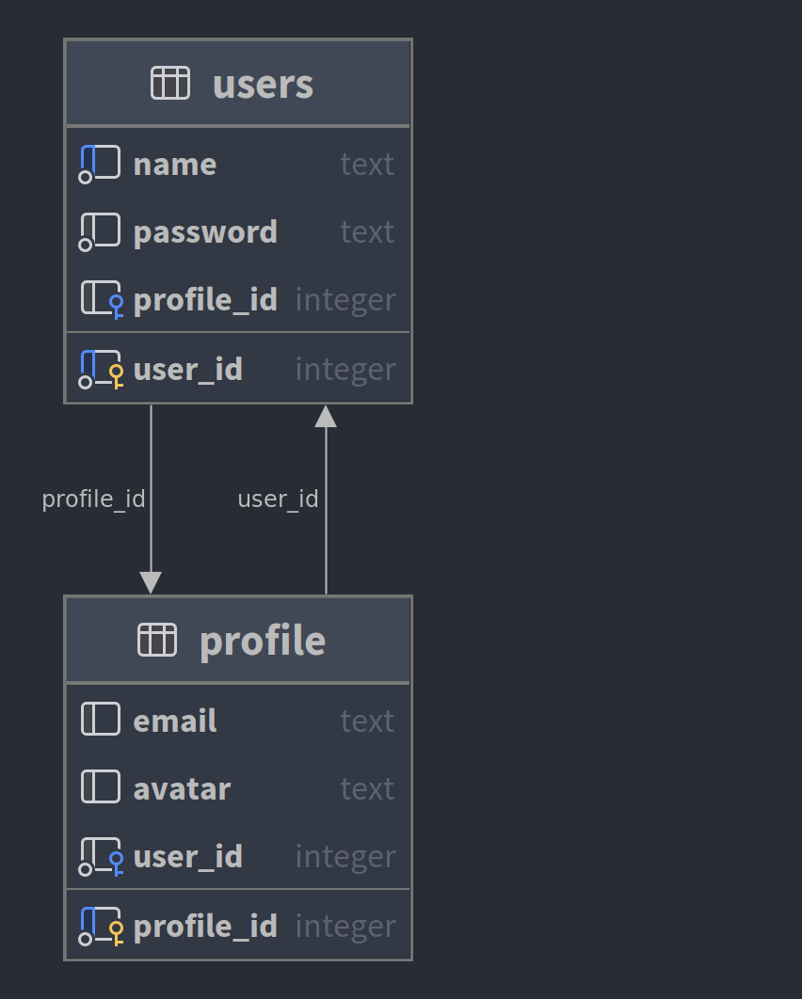

# 6 - Cycles entre les tables Utilisateurs et Profil

Exemples montrant comment gérer les cycles dans les définitions de tables.



## Exemple 1

```postgresql
create schema if not exists cycles1;
set search_path to cycles1;

create table users
(
    user_id  integer generated always as identity primary key,
    name     text unique not null,
    password text        not null
);

insert into users (name, password)
values ('Denis', 'aaaa'),
       ('Bob', 'bbbb');

create table profile
(
    profile_id integer generated always as identity primary key,
    email      text,
    avatar     text,
    user_id    integer references users (user_id) not null
);

insert into profile(email, avatar, user_id)
values ('denis@example.com', '/some/where.png', 1),
       ('bob@example.com', '/some/where/else.png', 2);

-- impossible d'ajouter la contrainte NOT NULL ici
alter table users
    add column profile_id integer references profile (profile_id);

update users set profile_id = 1 where user_id = 1;
update users set profile_id = 2 where user_id = 2;
```

## Exemple 2

```postgresql
create schema if not exists cycles2;
set search_path to cycles2;

create table users
(
    user_id    integer generated by default as identity primary key,
    name       text unique not null,
    password   text        not null,
    profile_id integer     not null
);

insert into users (user_id, name, password, profile_id)
values (1, 'Denis', 'aaaa', 1),
       (2, 'Bob', 'bbbb', 2);

create table profile
(
    profile_id integer generated by default as identity primary key,
    email      text,
    avatar     text,
    user_id    integer references users (user_id) not null
);

insert into profile(profile_id, email, avatar, user_id)
values (1, 'denis@example.com', '/some/where.png', 1),
       (2, 'bob@example.com', '/some/where/else.png', 2);

alter table users
    add constraint users_profile_fk foreign key (profile_id) references profile (profile_id);

-- spécifique à PostgreSQL
select last_value from users_user_id_seq;
select setval('users_user_id_seq', 2);

select last_value from profile_profile_id_seq;
select setval('profile_profile_id_seq', 2);
```

### Comment mettre à jour les données après avoir ajouté la contrainte ?

```postgresql
-- ces instructions ne fonctionneront pas
insert into users (name, password, profile_id)
values ('Ada', 'ada', 3);
insert into users (name, password)
values ('Ada', 'ada');

-- insérez un profile_id incorrect, mais assurez-vous de le modifier ultérieurement
-- attention : vérifiez bien que le profile_id sera effectivement 3
insert into users (name, password, profile_id)
values ('Ada', 'ada', 1);
insert into profile(email, avatar, user_id)
values ('ada@example.com', '/some/where/ada.png', 3);
update users set profile_id = 3 where user_id = 3;

-- dans un programme envoyant des requêtes SQL, on pourrait plutôt utiliser ceci
insert into users (name, password, profile_id)
values ('Pascal', 'pascal', 1) returning user_id;
-- et utiliser la valeur retournée dans les instructions suivantes

insert into profile(email, avatar, user_id)
values ('pascal@example.com', '/some/where/pascal.png', 4) returning profile_id;
update users set profile_id = 4 where user_id = 4;
```

## Exemple 3

```postgresql
create schema if not exists cycles3;
set search_path to cycles3;

create table users
(
    user_id    integer generated by default as identity primary key,
    name       text unique not null,
    password   text        not null,
    profile_id integer     not null
);

create table profile
(
    profile_id integer generated by default as identity primary key,
    email      text,
    avatar     text,
    user_id    integer not null
);

alter table users
    add constraint users_profile_fk foreign key (profile_id) references profile (profile_id) deferrable;

alter table profile
    add constraint profile_users_fk foreign key (user_id) references users (user_id) deferrable;

begin transaction;
set constraints users_profile_fk deferred;
insert into users (user_id, name, password, profile_id)
values (1, 'Denis', 'aaaa', 1),
       (2, 'Bob', 'bbbb', 2);

insert into profile(profile_id, email, avatar, user_id)
values (1, 'denis@example.com', '/some/where.png', 1),
       (2, 'bob@example.com', '/some/where/else.png', 2);

set constraints users_profile_fk immediate;

select last_value
from users_user_id_seq;
select setval('users_user_id_seq', 2);

select last_value
from profile_profile_id_seq;
select setval('profile_profile_id_seq', 2);
commit;

-- cela échouera
-- insert into users (name, password, profile_id)
-- values ('Ada', 'ada', 3);


begin transaction;

set constraints users_profile_fk deferred;
set constraints profile_users_fk deferred;

insert into users (name, password, profile_id)
values ('Ada', 'ada', 3)
returning user_id;

insert into profile(email, avatar, user_id)
values ('ada@example.com', '/some/where/ada.png', 3);

set constraints users_profile_fk immediate;
set constraints profile_users_fk immediate;

commit;
-- rollback;
```
