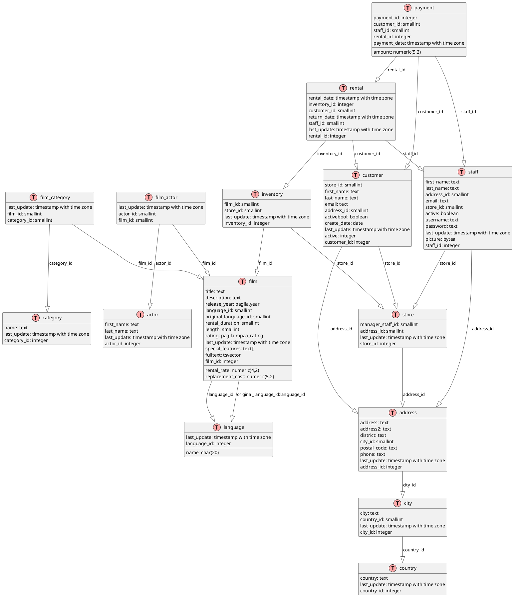

# 1. Base de données Pagila

## Création

[pagila_create.sql](../../src/create/pagila_create.sql)

## DEA

<details>
    <summary>Code</summary>


</details>


## Requêtes

### 1. Trouver des films d'au moins 2 heures

Difficulté : 1
<details>
    <summary>Code</summary>

```sql
SELECT title, length
FROM film
WHERE length >= 120
ORDER BY length DESC;
```
</details>
<br>

### 2. Trouver l'identifiant et la description du film 'ACADEMY DINOSAUR'

Difficulté : 1
<details>
    <summary>Code</summary>
    
```sql
SELECT film_id, description
FROM film
WHERE title = 'ACADEMY DINOSAUR';
```
</details>
<br>

### 3. Trouver les catégories de 'ACADEMY DINOSAUR'

Difficulté : 2
<details>
    <summary>Code</summary>
    
```sql
SELECT c.name
FROM category c
         JOIN film_category fc ON c.category_id = fc.category_id
         JOIN film f ON fc.film_id = f.film_id
WHERE f.title = 'ACADEMY DINOSAUR';
```
</details>
<br>

### 4. Trouver les films sans catégories

Difficulté : 2
<details>
    <summary>Code</summary>
    
```sql
SELECT f.title
FROM film f
         LEFT JOIN film_category fc ON f.film_id = fc.film_id
WHERE fc.category_id IS NULL;
```
</details>
<br>

### 5. Trouver les catégories sans films

Meilleure réponse :

Difficulté : 2
<details>
    <summary>Code</summary>
    
```sql
SELECT c.name
FROM category c
         LEFT JOIN film_category fc ON c.category_id = fc.category_id
WHERE fc.film_id IS NULL;
```
</details>
<br>

Autres réponses :

<details>
    <summary>Code</summary>
    
```sql
select c.category_id, c.name
from category c
         left join film_category fc on c.category_id = fc.category_id
group by c.category_id, c.name
having count(fc.film_id) = 0;
```
</details>
<br>

<details>
    <summary>Code</summary>
    
```sql
select category_id, name
from category
where category_id not in (select category_id from film_category);
```
</details>
<br>

<details>
    <summary>Code</summary>
    
```sql
select category_id, name
from category c
where not exists(select fc.category_id
                 from film_category fc
                 where fc.category_id = c.category_id);
```
</details>
<br>

<details>
    <summary>Code</summary>
    
```sql
select category_id, name
from category c
except
select c.category_id, c.name
from category c
         inner join film_category fc on fc.category_id = c.category_id;
```
</details>
<br>

<details>
    <summary>Code</summary>
    
```sql
select c.category_id, name
from category c
         inner join (select category_id
                     from category c
                     except
                     select fc.category_id
                     from film_category fc) as T
                    on c.category_id = T.category_id;
```
</details>
<br>

<details>
    <summary>Code</summary>
    
```sql
with T as (select category_id
           from category c
           except
           select fc.category_id
           from film_category fc)
select c.category_id, name
from category c
         inner join T on c.category_id = T.category_id;
```
</details>
<br>

### 6. Trouver les films d'action

Difficulté : 2
<details>
    <summary>Code</summary>
    
```sql
SELECT f.title
FROM film f
         JOIN film_category fc ON f.film_id = fc.film_id
         JOIN category c ON fc.category_id = c.category_id
WHERE c.name = 'Action';
```
</details>
<br>

### 7. Trouver le nombre de films dans la catégorie 'Action'

Difficulté : 2
<details>
    <summary>Code</summary>
    
```sql
SELECT COUNT(*) AS action_film_count
FROM film_category fc
         JOIN category c ON fc.category_id = c.category_id
WHERE c.name = 'Action';
```
</details>
<br>

### 8. Nombre de films dans chaque catégorie

Difficulté : 3
<details>
    <summary>Code</summary>
    
```sql
SELECT c.name, COUNT(fc.film_id) AS film_count
FROM category c
         LEFT JOIN film_category fc ON c.category_id = fc.category_id
GROUP BY c.category_id, c.name
ORDER BY film_count DESC;
```
</details>
<br>

### 9. Trouver le nombre de catégories pour chaque film

Difficulté : 3
<details>
    <summary>Code</summary>
    
```sql
SELECT f.title, COUNT(fc.category_id) AS category_count
FROM film f
         LEFT JOIN film_category fc ON f.film_id = fc.film_id
GROUP BY f.film_id, f.title
ORDER BY category_count DESC;
```
</details>
<br>

### 10. Trouver le nombre de films

Difficulté : 1
<details>
    <summary>Code</summary>
    
```sql
SELECT COUNT(*) AS total_films
FROM film;
```
</details>
<br>

### 11. Trouver le nombre de langues différentes dans la table des langues

Difficulté : 1
<details>
    <summary>Code</summary>
    
```sql
SELECT COUNT(*) AS language_count
FROM language;
```
</details>
<br>

### 12. Trouver le nombre de langues différentes dans la table des films

Difficulté : 1
<details>
    <summary>Code</summary>
    
```sql
SELECT COUNT(DISTINCT language_id) AS film_language_count
FROM film;
```
</details>
<br>

### 13. Catégorie avec le plus grand nombre de films

Difficulté : 3
<details>
    <summary>Code</summary>
    
```sql
SELECT c.name, COUNT(f.film_id) AS film_count
FROM category c
         JOIN film_category fc ON c.category_id = fc.category_id
         JOIN film f ON fc.film_id = f.film_id
GROUP BY c.category_id, c.name
ORDER BY film_count DESC
LIMIT 1;
```
</details>
<br>

Difficulté : 4
<details>
    <summary>Code</summary>
    
```sql
WITH category_counts AS (SELECT c.category_id, c.name, COUNT(f.film_id) AS film_count
                         FROM category c
                                  JOIN film_category fc ON c.category_id = fc.category_id
                                  JOIN film f ON fc.film_id = f.film_id
                         GROUP BY c.category_id, c.name),
     max_count AS (SELECT MAX(film_count) AS max_film_count
                   FROM category_counts)
SELECT cc.name AS category, cc.film_count
FROM category_counts cc,
     max_count mc
WHERE cc.film_count = mc.max_film_count
ORDER BY cc.name;
```
</details>
<br>

### 14. Liste des films les plus loués

Difficulté : 3

Pour obtenir la liste des 10 films les plus loués, avec leur titre et le nombre de locations :

<details>
    <summary>Code</summary>
    
```sql
SELECT f.title, COUNT(r.rental_id) AS rental_count
FROM film f
         JOIN inventory i ON f.film_id = i.film_id
         JOIN rental r ON i.inventory_id = r.inventory_id
GROUP BY f.film_id, f.title
ORDER BY rental_count DESC
LIMIT 10;
```
</details>
<br>

Difficulté : 4
<details>
    <summary>Code</summary>
    
```sql
WITH actor_counts AS (
    SELECT a.actor_id, a.first_name, a.last_name, COUNT(fa.film_id) AS film_count
    FROM actor a
    JOIN film_actor fa ON a.actor_id = fa.actor_id
    GROUP BY a.actor_id, a.first_name, a.last_name
),
top_5_count AS (
    SELECT film_count
    FROM actor_counts
    ORDER BY film_count DESC
    LIMIT 1 OFFSET 4
)
SELECT ac.first_name, ac.last_name, ac.film_count
FROM actor_counts ac, top_5_count t5c
WHERE ac.film_count >= t5c.film_count
ORDER BY ac.film_count DESC, ac.last_name, ac.first_name;
```
</details>
<br>

### 15. Revenus totaux par catégorie de film

Difficulté : 3

Pour calculer les revenus totaux générés par chaque catégorie de film :

<details>
    <summary>Code</summary>
    
```sql
SELECT c.name AS category, SUM(p.amount) AS total_revenue
FROM category c
         JOIN film_category fc ON c.category_id = fc.category_id
         JOIN film f ON fc.film_id = f.film_id
         JOIN inventory i ON f.film_id = i.film_id
         JOIN rental r ON i.inventory_id = r.inventory_id
         JOIN payment p ON r.rental_id = p.rental_id
GROUP BY c.category_id, c.name
ORDER BY total_revenue DESC;
```
</details>
<br>

### 16. Clients ayant dépensé le plus

Difficulté : 3

Pour obtenir les 10 clients ayant dépensé le plus, avec leur nom et le montant total :

<details>
    <summary>Code</summary>
    
```sql
SELECT c.first_name, c.last_name, SUM(p.amount) AS total_spent
FROM customer c
         JOIN payment p ON c.customer_id = p.customer_id
GROUP BY c.customer_id, c.first_name, c.last_name
ORDER BY total_spent DESC
LIMIT 10;
```
</details>
<br>

Difficulté : 4
<details>
    <summary>Code</summary>
    
```sql
WITH customer_spending AS (SELECT c.customer_id, c.first_name, c.last_name, SUM(p.amount) AS total_spent
                           FROM customer c
                                    JOIN payment p ON c.customer_id = p.customer_id
                           GROUP BY c.customer_id, c.first_name, c.last_name),
     top_10_spent AS (SELECT total_spent
                      FROM customer_spending
                      ORDER BY total_spent DESC
                      LIMIT 1 OFFSET 9)
SELECT cs.first_name, cs.last_name, cs.total_spent
FROM customer_spending cs,
     top_10_spent t10s
WHERE cs.total_spent >= t10s.total_spent
ORDER BY cs.total_spent DESC, cs.last_name, cs.first_name;
```
</details>
<br>

### 17. Films disponibles dans un magasin spécifique

Difficulté : 2

Pour obtenir la liste des films disponibles dans le magasin avec l'ID 1 :

<details>
    <summary>Code</summary>
    
```sql
SELECT DISTINCT f.title
FROM film f
         JOIN inventory i ON f.film_id = i.film_id
WHERE i.store_id = 1
ORDER BY f.title;
```
</details>
<br>

### 18. Quels sont les 5 acteurs qui ont joué dans le plus grand nombre de films ?

Difficulté : 3
<details>
    <summary>Code</summary>
    
```sql
SELECT a.actor_id, a.first_name, a.last_name, COUNT(fa.film_id) AS film_count
FROM actor a
         JOIN film_actor fa ON a.actor_id = fa.actor_id
GROUP BY a.actor_id, a.first_name, a.last_name
ORDER BY film_count DESC
LIMIT 5;
```
</details>
<br>

Difficulté : 4
<details>
    <summary>Code</summary>
    
```sql
WITH actor_counts AS (SELECT a.actor_id, a.first_name, a.last_name, COUNT(fa.film_id) AS film_count
                      FROM actor a
                               JOIN film_actor fa ON a.actor_id = fa.actor_id
                      GROUP BY a.actor_id, a.first_name, a.last_name),
     top_5_count AS (SELECT film_count
                     FROM actor_counts
                     ORDER BY film_count DESC
                     LIMIT 1 OFFSET 4)
SELECT ac.first_name, ac.last_name, ac.film_count
FROM actor_counts ac,
     top_5_count t5c
WHERE ac.film_count >= t5c.film_count
ORDER BY ac.film_count DESC, ac.last_name, ac.first_name;
```
</details>
<br>

### 19. Quel est le revenu total généré par chaque magasin ?

Difficulté : 3
<details>
    <summary>Code</summary>
    
```sql
SELECT s.store_id, s.address_id, SUM(p.amount) AS total_revenue
FROM store s
         JOIN staff st ON s.store_id = st.store_id
         JOIN payment p ON st.staff_id = p.staff_id
GROUP BY s.store_id, s.address_id
ORDER BY total_revenue DESC;
```
</details>
<br>

### 20. Quels sont les 10 films les plus rentables (basé sur le montant total des paiements) ?

Difficulté : 3
<details>
    <summary>Code</summary>
    
```sql
SELECT f.film_id, f.title, SUM(p.amount) AS total_revenue
FROM film f
         JOIN inventory i ON f.film_id = i.film_id
         JOIN rental r ON i.inventory_id = r.inventory_id
         JOIN payment p ON r.rental_id = p.rental_id
GROUP BY f.film_id, f.title
ORDER BY total_revenue DESC
LIMIT 10;
```
</details>
<br>

Difficulté : 4
<details>
    <summary>Code</summary>
    
```sql
WITH film_revenue AS (SELECT f.film_id, f.title, SUM(p.amount) AS total_revenue
                      FROM film f
                               JOIN inventory i ON f.film_id = i.film_id
                               JOIN rental r ON i.inventory_id = r.inventory_id
                               JOIN payment p ON r.rental_id = p.rental_id
                      GROUP BY f.film_id, f.title),
     top_10_revenue AS (SELECT total_revenue
                        FROM film_revenue
                        ORDER BY total_revenue DESC
                        LIMIT 1 OFFSET 9)
SELECT fr.film_id, fr.title, fr.total_revenue
FROM film_revenue fr,
     top_10_revenue t10r
WHERE fr.total_revenue >= t10r.total_revenue
ORDER BY fr.total_revenue DESC, fr.title;
```
</details>
<br>

### 21. Quelle est la durée moyenne de location pour chaque catégorie de film ?

Difficulté : 4
<details>
    <summary>Code</summary>
    
```sql
SELECT c.name, AVG(EXTRACT(DAY FROM (r.return_date - r.rental_date))) AS avg_rental_duration
FROM category c
         JOIN film_category fc ON c.category_id = fc.category_id
         JOIN film f ON fc.film_id = f.film_id
         JOIN inventory i ON f.film_id = i.film_id
         JOIN rental r ON i.inventory_id = r.inventory_id
WHERE r.return_date IS NOT NULL
GROUP BY c.category_id, c.name
ORDER BY avg_rental_duration DESC;
```
</details>
<br>

### 22. Quels sont les clients qui n'ont pas effectué de location depuis plus de 3 mois ?

Difficulté : 4
<details>
    <summary>Code</summary>
    
```sql
SELECT c.customer_id, c.first_name, c.last_name, MAX(r.rental_date) AS last_rental_date
FROM customer c
         LEFT JOIN rental r ON c.customer_id = r.customer_id
GROUP BY c.customer_id, c.first_name, c.last_name
HAVING MAX(r.rental_date) < CURRENT_DATE - INTERVAL '3 months'
    OR MAX(r.rental_date) IS NULL
ORDER BY last_rental_date;
```
</details>
<br>

### 23. Quels sont les films qui n'ont jamais été loués ?

Difficulté : 3
<details>
    <summary>Code</summary>
    
```sql
SELECT f.film_id, f.title
FROM film f
         LEFT JOIN inventory i ON f.film_id = i.film_id
         LEFT JOIN rental r ON i.inventory_id = r.inventory_id
WHERE r.rental_id IS NULL;
```
</details>
<br>

### 24. Quel est le client qui a dépensé le plus d'argent, et combien a-t-il dépensé ?

Difficulté : 3
<details>
    <summary>Code</summary>
    
```sql
SELECT c.customer_id, c.first_name, c.last_name, SUM(p.amount) AS total_spent
FROM customer c
         JOIN payment p ON c.customer_id = p.customer_id
GROUP BY c.customer_id, c.first_name, c.last_name
ORDER BY total_spent DESC
LIMIT 1;
```
</details>
<br>

Difficulté : 4
<details>
    <summary>Code</summary>
    
```sql
WITH customer_spending AS (SELECT c.customer_id, c.first_name, c.last_name, SUM(p.amount) AS total_spent
                           FROM customer c
                                    JOIN payment p ON c.customer_id = p.customer_id
                           GROUP BY c.customer_id, c.first_name, c.last_name),
     max_spending AS (SELECT MAX(total_spent) AS max_amount
                      FROM customer_spending)
SELECT cs.customer_id, cs.first_name, cs.last_name, cs.total_spent
FROM customer_spending cs,
     max_spending ms
WHERE cs.total_spent = ms.max_amount
ORDER BY cs.last_name, cs.first_name;
```
</details>
<br>

### 25. Quels sont les 5 couples d'acteurs qui ont joué ensemble dans le plus grand nombre de films ?

Difficulté : 5
<details>
    <summary>Code</summary>
    
```sql
SELECT a1.actor_id   AS actor1_id,
       a1.first_name AS actor1_first_name,
       a1.last_name  AS actor1_last_name,
       a2.actor_id   AS actor2_id,
       a2.first_name AS actor2_first_name,
       a2.last_name  AS actor2_last_name,
       COUNT(*)      AS films_together
FROM film_actor fa1
         JOIN film_actor fa2 ON fa1.film_id = fa2.film_id AND fa1.actor_id < fa2.actor_id
         JOIN actor a1 ON fa1.actor_id = a1.actor_id
         JOIN actor a2 ON fa2.actor_id = a2.actor_id
GROUP BY a1.actor_id, a1.first_name, a1.last_name, a2.actor_id, a2.first_name, a2.last_name
ORDER BY films_together DESC
LIMIT 5;
```
</details>
<br>

Difficulté : 5
<details>
    <summary>Code</summary>
    
```sql
WITH actor_pairs AS (SELECT LEAST(fa1.actor_id, fa2.actor_id)    AS actor1_id,
                            GREATEST(fa1.actor_id, fa2.actor_id) AS actor2_id,
                            COUNT(*)                             AS films_together
                     FROM film_actor fa1
                              JOIN film_actor fa2 ON fa1.film_id = fa2.film_id AND fa1.actor_id < fa2.actor_id
                     GROUP BY LEAST(fa1.actor_id, fa2.actor_id), GREATEST(fa1.actor_id, fa2.actor_id)),
     top_5_count AS (SELECT films_together
                     FROM actor_pairs
                     ORDER BY films_together DESC
                     LIMIT 1 OFFSET 4)
SELECT a1.actor_id   AS actor1_id,
       a1.first_name AS actor1_first_name,
       a1.last_name  AS actor1_last_name,
       a2.actor_id   AS actor2_id,
       a2.first_name AS actor2_first_name,
       a2.last_name  AS actor2_last_name,
       ap.films_together
FROM actor_pairs ap
         JOIN actor a1 ON ap.actor1_id = a1.actor_id
         JOIN actor a2 ON ap.actor2_id = a2.actor_id
         JOIN top_5_count t5c ON ap.films_together >= t5c.films_together
ORDER BY ap.films_together DESC, a1.last_name, a1.first_name, a2.last_name, a2.first_name;
```
</details>
<br>


-------

??? info "Utilisation de l'IA"
    Page rédigée en partie avec l'aide d'un assistant IA. L'IA a été utilisée pour générer des 
    explications, des exemples et/ou des suggestions de structure. Toutes les informations ont 
    été vérifiées, éditées et complétées par l'auteur.